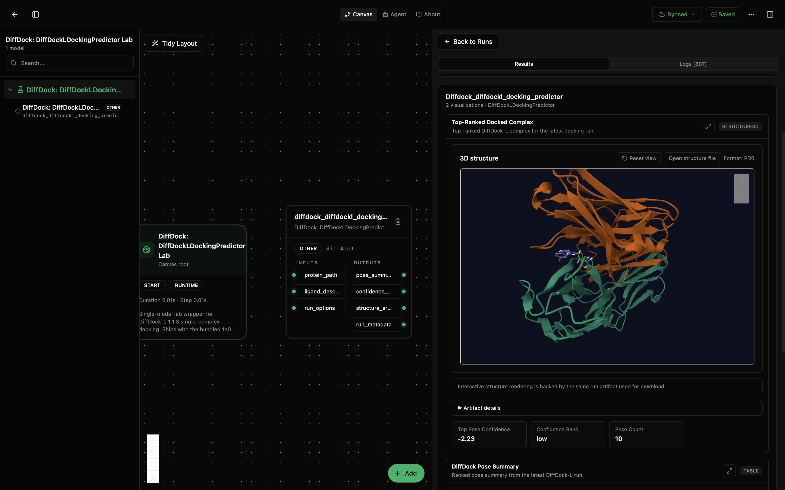
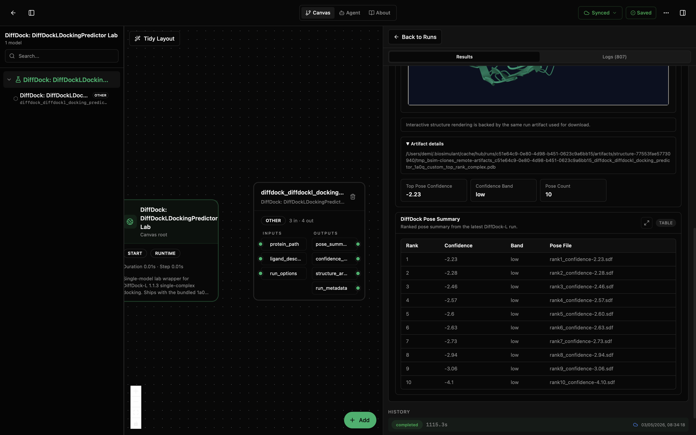

# DiffDock: DiffDockLDockingPredictor Lab

This lab runs a single DiffDock-L docking job for one prepared receptor PDB and one ligand. The ligand can be a SMILES string or a path to an RDKit-readable ligand file (`.sdf`, `.mol`, `.mol2`, `.pdb`, `.pdbqt`). The lab ships with the bundled `1a0q` receptor and a SMILES ligand so a fresh run produces ranked poses, a confidence summary, and a merged top-ranked complex without any extra setup.

The wrapper boots upstream DiffDock-L `v1.1.3` in managed runtime mode: it clones the pinned DiffDock repository, creates a venv from `model/requirements/runtime-gpu.txt`, and runs DiffDock inference from that managed environment. Subsequent runs reuse the cached repo and venv.

This lab is for single-complex docking only. It does not prepare receptors from raw PDBs, run virtual-screening batches, or train DiffDock from scratch. Those belong in adjacent labs.

## What You'll See

The lab opens as a small canvas with one DiffDock-L docking node and a run-results panel. With the bundled defaults, the run produces:

- a ranked pose table sorted by DiffDock confidence,
- a structure3d view of the top-ranked pose merged onto the receptor,
- a confidence summary with the top pose score and confidence band,
- run metadata with the executed command, returncode, and truncated stdout/stderr.

The first screenshot shows the canvas, node inputs and outputs, and the structure3d view for the top-ranked docked complex. The second scrolls down to the artifact details and ranked pose table for the same run, where the bundled `1a0q` job reports 10 poses and a top confidence of `-2.23` in the `low` band.





## How to Read the Visualizations

The pose ranking table lists each DiffDock pose with its rank, confidence score, confidence band, and the underlying SDF filename. DiffDock-L confidences are unitless log-likelihood-style scores: positive values are mapped to the `high` band, scores between `0` and `-1.5` to `moderate`, and scores below `-1.5` to `low`. Use the band as a quick read on whether the top pose is worth following up.

The structure3d view shows the receptor with the top-ranked ligand pose merged in as `top_rank_complex.pdb`. Use it to sanity-check that the ligand sits inside a plausible binding pocket. If the ligand sits outside the receptor surface, treat the run as low-confidence regardless of the score.

The confidence summary captures the top pose rank, its confidence, the confidence band, the total pose count, and every per-pose confidence so you can spot bimodal pose distributions. In the shown default run, all 10 poses are in the `low` band, so the result is best read as a structural smoke test and not as a high-confidence binding prediction. The run metadata reports which runtime mode executed, where the managed runtime cached the DiffDock checkout and venv, the resolved inference command, the returncode, the truncated stdout/stderr from DiffDock, and `status: completed` or `status: error` so a failed run is still inspectable.

## What This Lab Contains

- `lab.yaml` describes the lab, exposes its inputs and outputs, and pins the bundled defaults.
- `wiring-layout.json` places the model on the canvas.
- `model/model.yaml` describes the model package, parameters, and ports.
- `model/src/diffdockl_docking_predictor.py` contains the wrapper, managed runtime bootstrap, pose post-processing, and visualization shaping.
- `model/requirements/runtime-gpu.txt` pins the torch and PyG stack installed into the managed venv.
- `model/data/1a0q/` ships the receptor PDB and reference ligand SDF used by the bundled defaults.
- `model/tests/` checks the wrapper, runtime bootstrap, output parsing, and visualization contract.

## Inputs

The model accepts three input signals. Each one falls back to the matching `default_*` parameter in `lab.yaml` when the signal is not wired, which is what makes the lab runnable out of the box.

- `protein_path` (path): receptor PDB file. Defaults to `data/1a0q/1a0q_protein_processed.pdb`.
- `ligand_description` (str or path): SMILES string or path to an RDKit-readable ligand file. Defaults to the SMILES `COc(cc1)ccc1C#N`.
- `run_options` (record): DiffDock run options merged onto the bundled defaults.
  - `complex_name` (str): output subdirectory name for the run.
  - `samples_per_complex` (int): number of DiffDock samples to draw.
  - `inference_steps` (int): denoising steps per sample.
  - `batch_size` (int): inference batch size.
  - `save_visualisation` (bool): whether to ask DiffDock to write per-step reverse-process PDBs.

## Outputs

- `pose_summary` (record): ranked poses with rank, confidence, confidence band, and per-pose SDF file path.
- `confidence_summary` (record): aggregate confidence stats including `top_pose_confidence`, `confidence_band`, `pose_count`, and the full `all_confidences` list.
- `structure_artifacts` (record): file-backed artifacts including the merged `top_rank_complex.pdb` consumed by the structure3d renderer, the top pose SDF, the confidence and pose summary JSON files, and per-rank SDF and reverseprocess PDB paths.
- `run_metadata` (record): runtime metadata, runtime mode, runtime/cache directories, the executed command, returncode, truncated stdout/stderr, and `status: completed` or `status: error`.

## Running in Biosimulant Desktop

Import the lab once with the Biosim CLI, then open it from the desktop app. The bundled `1a0q` defaults mean the first run requires no parameter editing.

```bash
biosimulant labs import labs/diffdock-diffdockl-docking-predictor
```

To dock a different complex, override the inputs in the lab's run sidebar (or wire them to a source module that produces a receptor PDB path and a ligand SMILES or file). The model treats wired input signals as overrides on top of the defaults, so partial overrides work too.

## Notes

- The first real run needs internet access (to clone the upstream DiffDock repo and download model checkpoints) and a working `git` executable. Subsequent runs are offline.
- DiffDock-L is GPU-friendly. CPU inference works for short smoke tests but is slow for production sample counts.
- Managed runtime mode is required for remote execution. External mode (using a pre-installed DiffDock environment) is supported for local debugging via `runtime_mode: external` plus `runtime_python`.
- `model/data/1a0q/` is shipped as part of the model package so the defaults resolve in remote runs too.
